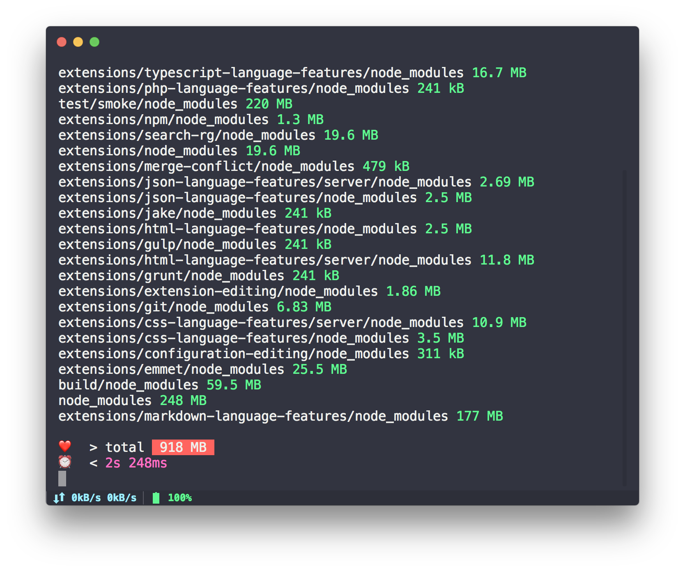

# snapshot

「 快照 」

> about modules size with node_modules hole

<details>

<summary>
My Computer node_modules hole 🌞
</summary>


</details>

---

<!-- START doctoc generated TOC please keep comment here to allow auto update -->
<!-- DON'T EDIT THIS SECTION, INSTEAD RE-RUN doctoc TO UPDATE -->


  - [vue-cli](#vue-cli)
  - [ava](#ava)
  - [kap](#kap)
  - [hyper](#hyper)
  - [vscode](#vscode)
- [Tips](#tips)
- [Live](#live)
  - [Use  node-modules-size output path and size info](#use--node-modules-size-output-path-and-size-info)

<!-- END doctoc generated TOC please keep comment here to allow auto update -->

### vue-cli

- [vue-cli@3.0.0-beta.15](https://github.com/vuejs/vue-cli/tree/v3.0.0-beta.15)


### ava

- [ava@v1.0.0-beta.5](https://github.com/avajs/ava/tree/v1.0.0-beta.5)


- [ava@1.0.0-beta.4](https://github.com/avajs/ava/tree/v1.0.0-beta.4)


### kap

- [kap@2.1.2](https://github.com/wulkano/kap/tree/v2.1.2)


### hyper

- [hyper@2.1.0-canary.1](https://github.com/zeit/hyper/tree/2.1.0-canary.1)


### vscode

- [package.json==1.26](https://github.com/Microsoft/vscode/tree/fd4bf73a031cbe1135e7cde3b3386627a92fe601)




---

## Tips 

Can use partner of https://github.com/junegunn/fzf 

```
node-modules-size | fzf
```

Search what you want

## Live

[help me live , live need money 💰](https://github.com/chinanf-boy/live-need-money)

### Use  [node-modules-size](https://github.com/chinanf-boy/node-modules-size) output path and size info