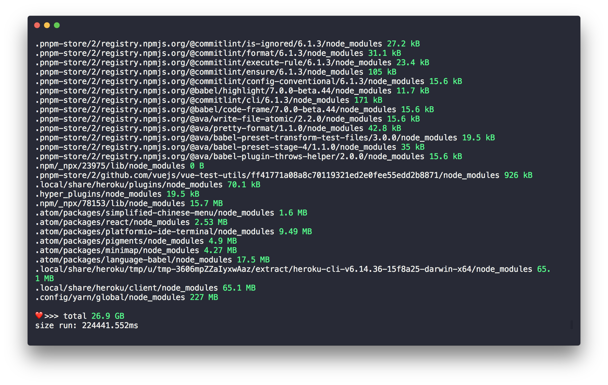
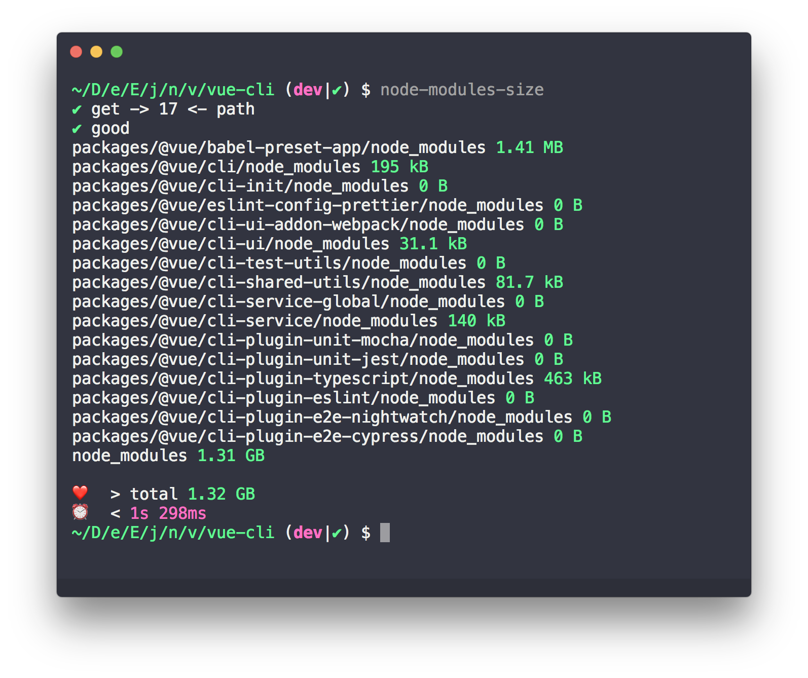
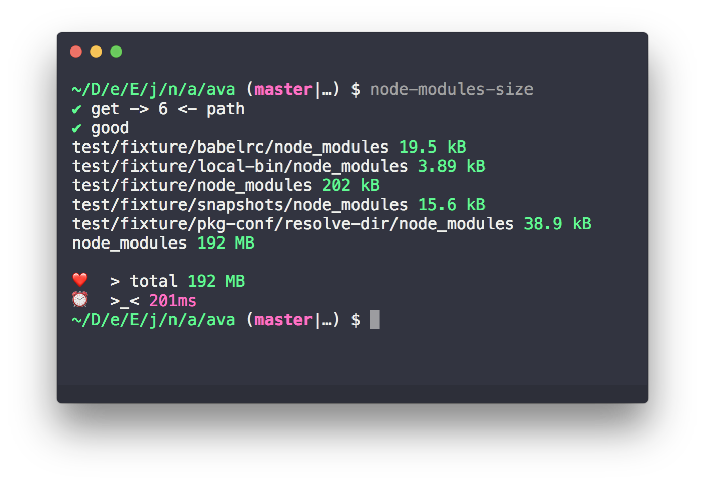
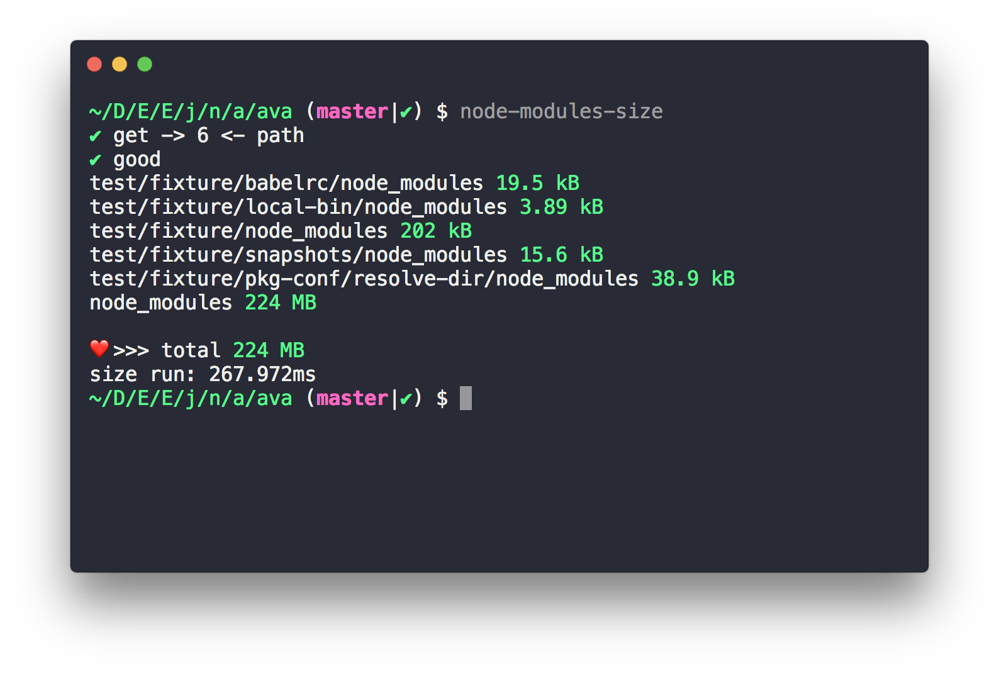
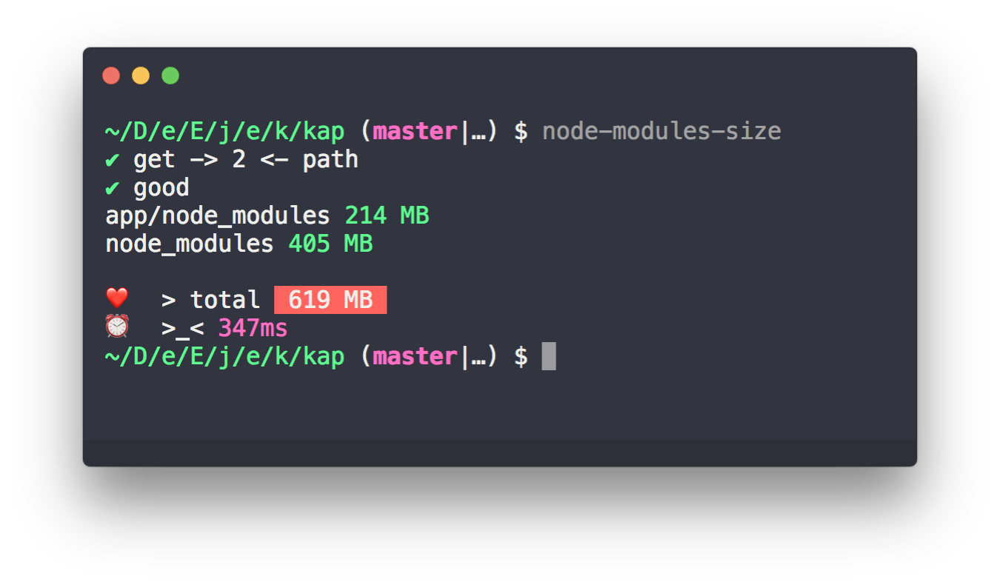
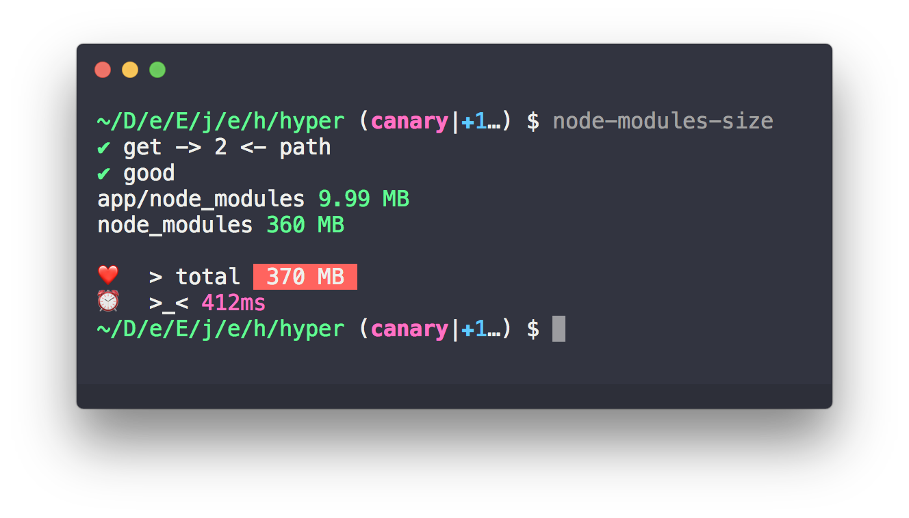

# snapshot

「 快照 」

> about modules size with node_modules hole

My Computer node_modules hole 🌞

---

<!-- START doctoc generated TOC please keep comment here to allow auto update -->
<!-- DON'T EDIT THIS SECTION, INSTEAD RE-RUN doctoc TO UPDATE -->

- [vue-cli](#vue-cli)
- [ava](#ava)
- [kap](#kap)
- [hyper](#hyper)
- [Use  node-modules-size](#use--node-modules-size)

<!-- END doctoc generated TOC please keep comment here to allow auto update -->

### vue-cli

- [vue-cli@3.0.0-beta.15](https://github.com/vuejs/vue-cli/tree/v3.0.0-beta.15)

### ava

- [ava@v1.0.0-beta.5](https://github.com/avajs/ava/tree/v1.0.0-beta.5)

- [ava@1.0.0-beta.4](https://github.com/avajs/ava/tree/v1.0.0-beta.4)

### kap

- [kap@2.1.2](https://github.com/wulkano/kap/tree/v2.1.2)

### hyper

- [hyper@2.1.0-canary.1](https://github.com/zeit/hyper/tree/2.1.0-canary.1)

---

### Use  [node-modules-size](https://github.com/chinanf-boy/node-modules-size)